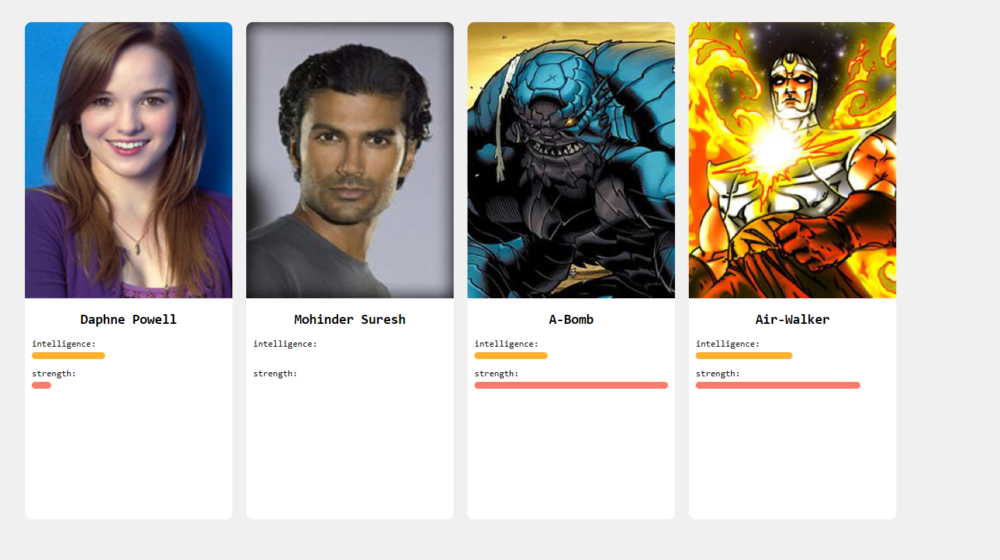

# Prova de Conceito: SuperHeroe - Next.js

## Feito Por:

- Artur Valladares Hernandez Giacummo - 10389053  
- Gabriel Marques Gonçalves Almeida - 10375711  

## Como Executar o Código

Para acessar esta prova de conceito (POC) siga os passos abaixo:

1. **Baixar o Projeto**  
   - Acesse o repositório do projeto e clique em **"Código"**.  
   - Selecione a opção **"Baixar ZIP"** para obter o arquivo compactado do projeto.  

2. **Descompactar o Arquivo**  
   - Após o download, localize o arquivo ZIP em seu computador.  
   - Descompacte o arquivo para uma pasta de sua escolha.

3. **Instalar as dependências**  
   - No diretório do seu projeto, execute:  
     ```bash
     npm install
     ```

4. **Executar o servidor de desenvolvimento**  
   - No diretório do projeto, execute:  
     ```bash
     npm run dev
     ```

5. **Acessar o projeto no navegador**  
   - Abra o navegador e acesse:  
     [http://localhost:3000](http://localhost:3000)


## Requisitos
- **Node.js** versão 14 ou superior
- **Next.js** versão 14 ou superior

## Visão Geral
 Nesta POC, foi utilizado o **Next.js** para consumir a API **SuperHero API** e exibir informações como nome, inteligência, força e imagem de heróis.
 
### O que é a SuperHero API? 
 
 A SuperHero API é uma API REST que fornece informações sobre diversos super-heróis. Cada super-herói é identificado por um ID único, utilizado para realizar as requisições. 

### Exemplo de Requisição A aplicação utiliza o seguinte formato de URL para realizar a requisição de dados:

`https://superheroapi.com/api.php/${ACCESS_TOKEN}/${heroId}`


- **`ACCESS_TOKEN`**: Token necessário para autenticar a requisição.
- **`heroId`**: Identificador do herói na API.

### Exemplo de Resposta da API

```json
{
  "name": "Superman",
  "powerstats": {
    "intelligence": 94,
    "strength": 100
  },
  "image": {
    "url": "https://www.superherodb.com/pictures2/portraits/10/100/791.jpg"
  ```


## Funcionamento da Aplicação

1. A aplicação recebe um código de herói como propriedade no componente React.
2. Utilizando o método `XMLHttpRequest`, a aplicação faz uma requisição GET para a SuperHero API.
3. Após receber a resposta, os dados são renderizados no navegador, incluindo:
   - **Nome do herói**
   - **Imagem**
   - **Nível de inteligência**
   - **Força**

## Exemplo de Uso

A aplicação utiliza um componente React chamado `Hero`, que é responsável por consumir dados da SuperHero API e exibi-los no navegador. Este componente realiza uma requisição à API utilizando o método `fetch` e renderiza as informações do herói com base no código (`code`) fornecido como propriedade.

```javascript
export default function Hero({ code }) {
    const ACCESS_TOKEN = "seu_token_aqui";
    const BASE_URL = `https://superheroapi.com/api.php/${ACCESS_TOKEN}/`;

    const [heroData, setHeroData] = useState({
        name: '',
        intelligence: 0,
        image: '',
        strength: 0,
    });

    useEffect(() => {
        const fetchData = async () => {
            try {
                const response = await fetch(BASE_URL + code);
                const data = await response.json();
                setHeroData({
                    name: data.name,
                    intelligence: data.powerstats.intelligence,
                    image: data.image.url,
                    strength: data.powerstats.strength,
                });
            } catch (error) {
                console.error("Erro ao buscar dados do herói:", error);
            }
        };

        fetchData();
    }, [code]);

    return (
        <article>
            {heroData.image && }
            <h1>{heroData.name}</h1>
            <p>Intelligence: {heroData.intelligence}</p>
            <p>Strength: {heroData.strength}</p>
        </article>
    );
}
```

### Resultado Visual 

Abaixo está um exemplo de como os dados dos heróis são exibidos no navegador: 


